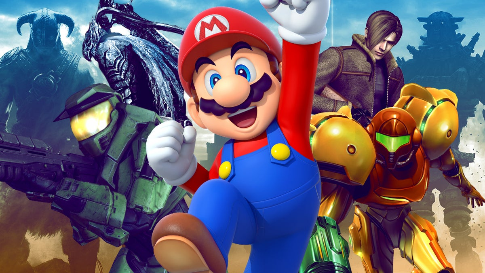
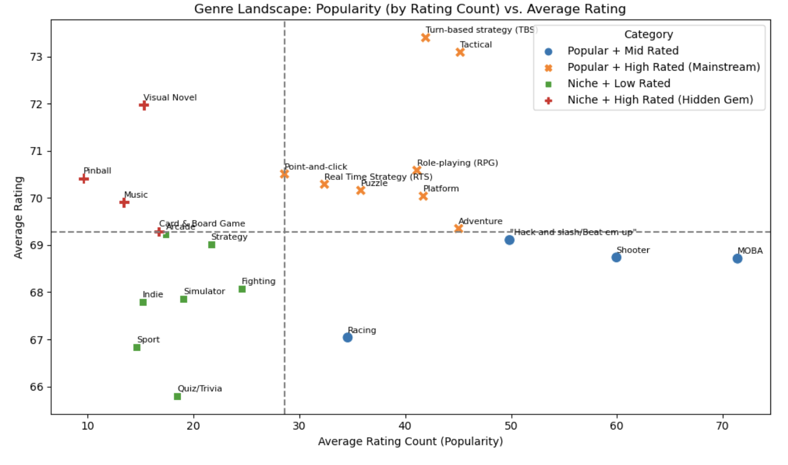
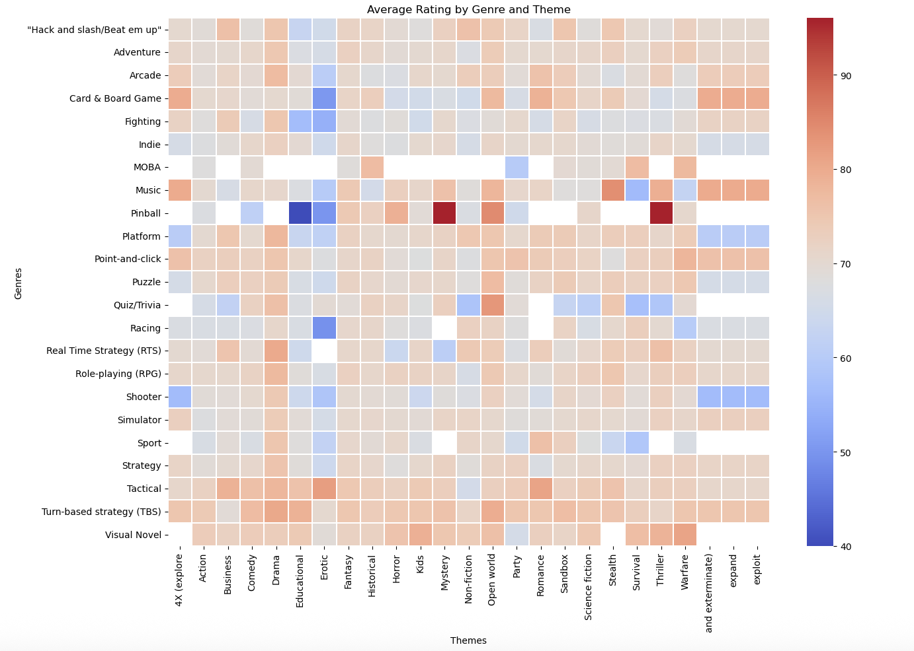
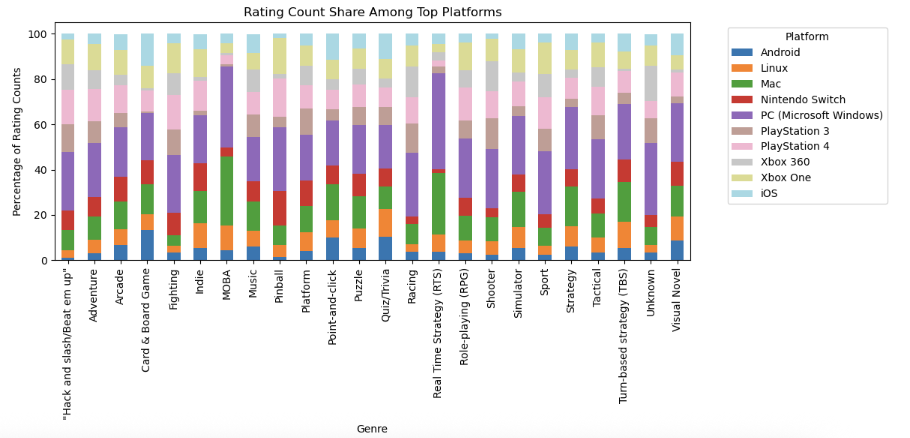
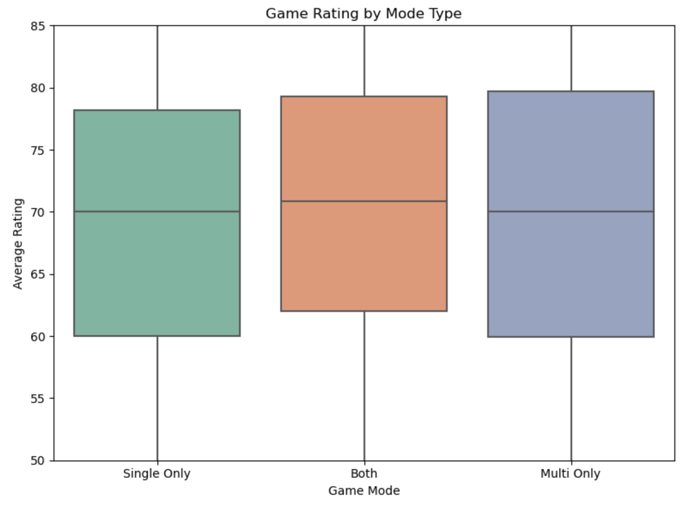
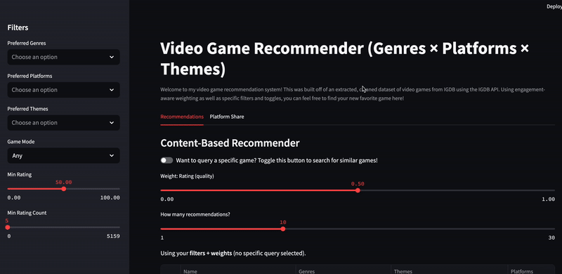

# Video Games Market Analysis and Recommender

## Project Overview
This project combines Exploratory Data Analysis with a production-ready Recommender app centered around the insights that came from the EDA. The EDA utilizes a dataset that was extracted from IGDB.com, a video game database acquired by Twitch, via the IGDB API to provide video game information from 30k+ known video games that contain user ratings amongst a realm of 200k+ total game titles. The notebook explores common trends for games that contain user ratings from IGDB and external critics. 

Here we try to answer the following questions to be tailored towards video game marketing and creation teams: 
1. In which genres does the highest engagement occur?
2. Which theme-genre pairs improve or hurt ratings and engagement?
3. Which gaming platform sees the most success for each genre?
4. Do multi-player games play a factor in getting higher ratings and rating counts than single-player games regardless of platforms, genres, themes, age ratings, and player perspectives?
5. How do game ratings look for different platforms, genres, themes, age ratings and player perspectives and discuss why?

## Table of Contents
- [Project Overview](#project-overview)
- [Summary Of Insights](#summary-of-insights)
- [Recommendations](#recommendations)
- [Assumptions](#assumptions)
- [Demo-Preview](#demo-preview)
- [Installation](#installation)

## Summary of Insights

### Popularity vs Quality
- Adventure is the most common and most engaged genre, sporting over 40% of the entire gaming catalogue and representing 67% of the top 500 games in rating counts. However, it is not included in the top 10 genres organized by average rating, implying that there is saturation in the genre, as well as a generally wide diaspora of player experiences with the genre.
- The Turn‑Based Strategy and Tactical genres rank highest in average rating (~75 for both genres, while all other genres generally float around scores of 70 or below) despite having a smaller presence, altogether appearing in only 7.3% of all games. This suggests that the two genres reach "hidden gem" territory, in which players who enjoy the genres are more likely to enjoy other games from that genre despite its niche.
- Using Avg Rating Count (ARC) vs Avg Rating to classify genres shows a clear split:
  - Popular + High Rated (mainstream winners)
  - Niche + High Rated (hidden gems)
  - Popular + Mid Rated
  - Niche + Low Rated
 


### Theme & Genre Combinations 
- Themes of Fantasy, Open World, and Drama raise ratings across genres to a steady 70-80 score, suggesting that they are broad crowd-pleasers and most likely to be received well by audiences despite the genre.
- Erotic (and sometimes Educational) themes depress ratings across most genres, *except* for Tactical, implying that these themes are only compatible with games emphasizing decision-making and strategy.
- Adventure is stable across themes, while Pinball, Shooter, Racing show strong theme sensitivity. For example, Pinball/Mystery and Pinball/Thriller shoot the average rating up to scores of 90+, while Pinball/Educational combinations are generally not enjoyed.




### Platforms: Availability vs Engagement
- PC (Windows) leads by title count and engagement, representing 23.23% of all title releases. Their presence is most seen in MOBAs (Multiplayer Online Battle Arena) and RTS (Real-Time Strategy) games, both containing 35% % of their respective genre rating counts.
  - Interestingly, Mac shows an almost equal share of rating counts as PC in the MOBA and RTS genres and is most engaged here (almost 30%), suggesting that Mac users are just as interested in the genres as PC users; higher compatibility for both consoles would thus be advised.
- Nintendo Switch shows diverse engagement overall but comparatively lower in Racing, Shooter, and RTS (<5%), suggesting that Switch has a less marketable niche for these genres.



### Game Modes and Ratings
- Games that feature exclusively Multiplayer games boast the highest average ratings of ~80% compared to Single-only (~77%) and games that contain both Single and Multiplayer options (79%).
  - We see high significance in these values, with p < 0.0001, indicating consistency in these average ratings among the categories.
- This does make theoretical sense, as people tend to enjoy flexibility in choosing their mode of playing, and having the option to play alone versus with other people provides different perspectives of playing, which can lead to more overall enjoyment. Additionally, games that contain both modes would be more likely to have a greater amount of money, time, and resources to be invested in their creation, as opposed to single-only games which may fluctuate greatly in this aspect. Lastly, those who enjoy multiplayer-only games are more likely to enjoy games anyway when they're playing alongside their friends due to mutually shared company and entertainment.



## Recommendations

### Genre/Theme Focus
- If developing Racing/Shooter games, consider straying away from Nintendo Switch for shipping, as less engagement is seen here overall. Playstation, Xbox, and PC all see the highest engagement for these genres.
- Use Fantasy/Open World/Drama as anchor themes in trailers/storefronts and marketing campaigns for relevant titles, as gaming playerbases are becoming more drawn to exploration, larger amounts of content, and original, enticing storytelling in recent years. 

### Platform Targeting
- Promote RTS/MOBA more heavily on PC & Mac/Linux channels with a greater emphasis on equal compatibility. It is well-known that PC contains more compatible functions for high-end gaming, but other computer types additionally contain large playerbases. 
- Craft Switch‑specific bundles around Adventure/RPG.

### Player Mode Availability 
- Double‑down on “Both” modes for broad appeal and higher ratings if resources allow; flexibility adds value.


## Assumptions 
- Ratings represent satisfaction, Rating Count approximates engagement/awareness.
- The cleaned extraction dataset from IGDB makes a reasonable representation of the gaming industry. 
- A game’s feature text (genres, themes, platforms, game modes) is a reasonable proxy for content similarity (content‑based filtering).
- Minimum review thresholds (e.g., ≥ 5 ratings for Hidden Gems) reduce noisy picks.
- IGDB coverage skews toward certain platforms/regions; “unrated” games excluded from rating‑based insights.

## Demo Preview
The EDA was performed in a Jupyter Notebook, while the Recommender System was initialized using Streamlit in a Python file. 

The Recommender app is in itself a separate project, but utilizes inspiration from the insights found in the EDA. This app was designed to be consumer-focused, to guide video game players to their next favorite video game. It contains a choice to input a game you've previously played in order to receive recommendations based on similar games. 

There are multiple filters to guide the app's recommendations, such as preferred platform(s), genre(s), and theme(s). It is also possible to see "hidden gems" below the standard recommendations, based off of higher ratings and lower engagement based on the dataset. 



## Installation
To use this project, first clone the repository on your device using the command below: 

```git init```

```git clone https://github.com/kim-andrewj/video-games-market-analysis-and-recommender.git```


